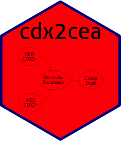

<!-- README.md is generated from README.Rmd. Please edit that file -->

```{r, echo = FALSE}
knitr::opts_chunk$set(
  collapse = TRUE,
  comment = "#>",
  fig.path = "docs/figs/"
)
```

[](https://zenodo.org/badge/latestdoi/331070175)

# cdx2cea 
<!--  -->

[`cdx2cea`](https://github.com/feralaes/cdx2cea) is an R package that implements the cost-effectiveness analysis (CEA) of testing average-risk Stage II colon cancer patients for the absence of CDX2 biomarker expression followed by adjuvant chemotherapy. 
<!-- The main website of `cdx2cea` can be [found here](https://feralaes.github.io/cdx2cea/). -->

[`cdx2cea`](https://github.com/feralaes/cdx2cea) is part of the following manuscript:

- Alarid-Escudero F, Schrag D, Kuntz KM. ["CDX2 biomarker testing and adjuvant therapy for stage II colon cancer: An exploratory cost-effectiveness analysis"](https://www.sciencedirect.com/science/article/pii/S1098301521017472) *Value in Health* 2022; 25(3):409-418. https://doi.org/10.1016/j.jval.2021.07.019

The release that accompanies the published article has been archived in zenodo: https://zenodo.org/record/5093594#.YPYyDy1h1qs

## How to cite this package in your article

You can cite this package like this "we based our analysis using the cdx2cea R package (Alarid-Escudero F, Schrag D, and Kuntz KM 2021)". Here is the full bibliographic reference to include in your reference list for the manuscript and the package (don't forget to update the 'last accessed' date):

> Alarid-Escudero F, Schrag D, Kuntz KM. ["CDX2 biomarker testing and adjuvant therapy for stage II colon cancer: An exploratory cost-effectiveness analysis"](https://www.sciencedirect.com/science/article/pii/S1098301521017472). *Value in Health* 2022; 25(3):409-418.

> Alarid-Escudero F, Schrag D, Kuntz KM (2021). {cdx2cea}: A cost-efectiveness analysis of testing stage II colon cancer patients for the absence of CDX2 biomarker followed by adjuvant chemotherapy (Version v1.0.0). Zenodo. [10.5281/zenodo.5093594](https://www.doi.org/10.5281/zenodo.5093594). Last accessed 12 July 2021

## Preliminaries
- Install [RStudio](https://www.rstudio.com/products/rstudio/download/)
- Install `devtools` to install `cdx2cea` as a package and modify it to generate your own package
```{r, eval=FALSE}
# Install release version from CRAN
install.packages("devtools")

# Or install development version from GitHub
# devtools::install_github("r-lib/devtools")
```

We recommend reading the tutorials on cohort state-rtansition models (cSTMs) in R:

- Alarid-Escudero F, Krijkamp EM, Enns EA, Yang A, Hunink MGM, Pechlivanoglou P, Jalal H. [An Introductory Tutorial on Cohort State-Transition Models in R Using a Cost-Effectiveness Analysis Example](https://journals.sagepub.com/doi/full/10.1177/0272989X221103163). [Medical Decision Making](https://journals.sagepub.com/home/mdm), 2023;43(1):3-20. https://doi.org/10.1177/0272989X221103163

- Alarid-Escudero F, Krijkamp EM, Enns EA, Yang A, Hunink MGM, Pechlivanoglou P, Jalal H. [A Tutorial on Time-Dependent Cohort State-Transition Models in R using a Cost-Effectiveness Analysis Example](https://journals.sagepub.com/doi/full/10.1177/0272989X221121747). [Medical Decision Making](https://journals.sagepub.com/home/mdm). 2023;43(1):21-41. https://doi.org/10.1177/0272989X221121747

and understanding the use of multidimensional arrays to represent cSTM dynamics in R described in:

- Krijkamp EM, Alarid-Escudero F, Enns EA, Pechlivanoglou P, Hunink MGM, Yang A, Jalal HJ. [A multidimensional array representation of state-transition model dynamics](https://journals.sagepub.com/doi/full/10.1177/0272989X19893973). [Medical Decision Making](https://journals.sagepub.com/home/mdm), 2020;40(2):242-248. https://doi.org/10.1177/0272989X19893973,

and familiarizing with the [DARTH](http://darthworkgroup.com) coding framework described in:

- Alarid-Escudero F, Krijkamp EM, Pechlivanoglou P, Jalal HJ, Kao SYZ, Yang A, Enns EA. [A Need for Change! A Coding Framework for Improving Transparency in Decision Modeling](https://link.springer.com/article/10.1007/s40273-019-00837-x). [PharmacoEconomics](https://www.springer.com/journal/40273), 2190;37(11):1329–1339. https://doi.org/10.1007/s40273-019-00837-x

To run the CEA, you require [`dampack`: Decision-Analytic Modeling Package](https://cran.r-project.org/web/packages/dampack/index.html), an R package for analyzing and visualizing the health economic outputs of decision models.

## Usage and installation 
`cdx2cea` repository could be used in two different ways:

1. [Regular coding template](#use-repository-as-a-regular-coding-template) for using it to generate a repository of your own model-based decision or cost-effectiveness analysis
2. [R package](#use-as-an-r-package) for using it as a standalone package to run current functions of `cdx2cea`

<!-- The main website of the package could be found in: https://feralaes.github.io/feralaes/ -->

## Use repository as a regular coding template
1. On the `cdx2cea` GitHub repository, navigate to the main page of the repository (https://github.com/feralaes/cdx2cea).
2. Above the file list, click **Clone or download** and select either 
    a. **Open in desktop**, which requires the user to have a GitHub desktop installed, or
    b. **Download zip** that will ask the user to download the whole repository as a .zip file.
3. Open the RStudio project `cdx2cea.Rproj`.
4. Install all the required and suggested packages listed in the  [*DESCRIPTION*](https://github.com/feralaes/cdx2cea/blob/master/DESCRIPTION) file in the main folder of the repository
    - To install `cdx2cea`, please follow these instructions:
```{r, eval=FALSE}
# Install development version from GitHub
devtools::install_github("feralaes/cdx2cea")
```
5. In RStudio, load all the functions and data from the repository by typing `devtools::load_all(".")`
6. Run all the decision modeling modules in the analysis folder.

## Use as an R package
1. Install the development version of `cdx2cea` from [GitHub](https://github.com) with:

```{r, eval=FALSE}
devtools::install_github("feralaes/cdx2cea")
```

2. Load all the functions and data from the repository by typing 
```{r, eval=FALSE}
library(cdx2cea)
```

## Citation

Alarid-Escudero F, Schrag D, Kuntz KM (2021). cdx2cea: A cost-efectiveness analysis of testing stage II colon cancer patients for the absence of CDX2 biomarker followed by adjuvant chemotherapy (Version v1.0.0). Zenodo. [http://doi.org/10.5281/zenodo.5093594](http://doi.org/10.5281/zenodo.5093594)

## Acknowledgements

This work was supported by a grant from Fulbright and the National Council of Science and Technology of Mexico (CONACYT) and a Doctoral Dissertation Fellowship from the Graduate School of the University of Minnesota as part of Dr. Alarid-Escudero's doctoral program. Drs. Kuntz and Alarid-Escudero were supported by two grants from the National Cancer Institute at the National Institutes of Health (grant numbers U01-CA-199335 and U01-CA-253913) as part of the Cancer Intervention and Surveillance Modeling Network (CISNET). The funding agencies had no role in the design of the study, interpretation of results, or writing of the manuscript. The content is solely the responsibility of the authors and does not necessarily represent the official views of the National Institutes of Health. The funding agreement ensured the authors' independence in designing the study, interpreting the data, writing, and publishing the report. No other funding noted.